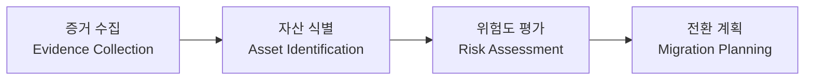

# 00. 시스템 개요 (Overview)

## 0.1 프로젝트 정보

| 항목 | 내용 |
|---|---|
| 프로젝트명 | PQC 전환 자동화 기술 및 암호화 민첩성 연구 |
| 시스템명 | **Context-Aware PQC Risk Assessment System** |
| 팀 | 양자택일 (산학연계캡스톤디자인 1조) |
| 멘토 | 김병구 책임연구원 (ETRI) |
| 지도교수 | 김영수 교수 (인공지능사이버보안학과) |
| 기준 표준 | NIST SP 1800-38B, CycloneDX CBOM, NIST IR 8547 |

## 0.2 시스템 목적

본 시스템은 NIST SP 1800-38B에서 제시한 **Quantum Readiness: Cryptographic Discovery** 방법론을 구현한 도구이다. 조직 내 운영 환경에서 사용 중인 암호자산을 자동으로 식별하고, 이를 구조화된 CBOM(Cryptography Bill of Materials)으로 정리하며, 양자 취약성과 운영 컨텍스트를 고려한 위험도 평가를 통해 PQC(Post-Quantum Cryptography) 전환 우선순위를 도출한다.

본 시스템은 다음 4단계 파이프라인으로 구성된다.

## 0.3 시스템 범위

### 범위 내 (In Scope)

- **테스트베드**: 25개 서비스 환경 구성 (core protocol fixtures + 200~300명 IT 회사 PoC용 enterprise TLS fixtures)
- **암호자산 식별**: Network Scanner + Agent 기반 File Scanner를 통한 다중 경로 식별
- **CBOM 생성**: CycloneDX 1.6 CBOM 스펙 기반 + 자체 확장 필드
- **위험도 평가**: 정량(휴리스틱 + 사용자 입력) + 정성(LLM, 인터페이스만 정의) 하이브리드
- **CBOM 스냅샷 관리**: 스캔 단위 스냅샷 저장 및 diff 비교
- **Migration Plan 보고서**: 자산별 권장 PQC 전환 전략 (실제 전환 실행은 v2)

### 범위 외 (Out of Scope, v2 이후)

- 실제 PQC 전환 실행 (인증서 재발급, 서비스 설정 변경, 재시작) — D2 단계
- LLM 정성 분석 모듈의 실제 구현 (인터페이스만 정의, mock으로 처리)
- 멀티 사용자, RBAC, SSO
- 외부 GRC/SIEM 시스템 연동

## 0.4 주요 결정사항 요약

| ID | 항목 | 결정 |
|---|---|---|
| D-01 | 시스템과 테스트베드 분리 | 별도 docker-compose, 시스템이 테스트베드를 외부에서 스캔 |
| D-02 | 비동기 작업 처리 | REST 폴링 (`GET /jobs/{id}`) |
| D-03 | 데이터 영속성 | PostgreSQL 16 |
| D-04 | 사용자 모델 | 싱글 유저, 인증 없음 |
| D-05 | Target 등록 방식 | CIDR 자동 디스커버리 (사용자 선택 후 등록) |
| D-06 | 스캐너 실행 단위 | 1 Job, 사용자가 스캐너 종류 선택 (체크박스) |
| D-07 | 스캐너 모델 | **Network Scanner (필수, 기본)** + **Agent (옵션, capability 확장)**. 실제 기업 환경에서 Agent 배포는 고객사 협조 의존이므로 Network 기반 외부 스캔이 기본 |
| D-07a | Agent 통신 (사용 시) | Hybrid (Push 등록 + Pull 트리거), 토큰 기반 인증 |
| D-08 | CBOM 단위 | 스캔 1회당 스냅샷 1개 (Snapshot 모델) |
| D-09 | 위험도 표현 | 0–100 점수 + Critical/High/Medium/Low 등급 매핑 |
| D-10 | LLM 정성 분석 | 인터페이스만 정의, 구현은 v2 (mock 응답) |
| D-11 | 운영 컨텍스트 입력 | Target 등록 시 입력 → Asset 상속 + Asset별 override 가능 |
| D-12 | 비암호 자산 | 포함 (Systems, Networks, Service Role) |
| D-13 | 인증서 체인 | Leaf/Intermediate/Root 모두 별개 자산 |
| D-14 | Migration Plan 단계 | 권고안/시뮬레이션만 (8c) |
| D-15 | 백엔드 스택 | Django + Django Ninja + Celery + Redis |
| D-16 | 프론트 스택 | React 18 + TypeScript + Vite + TanStack Query + shadcn/ui + Recharts |
| D-17 | 호스트네임 해석 | 테스트베드 측 dnsmasq + 시스템에서 resolver 지정 |
| D-18 | 디자인 톤 | 라이트/다크 토글 (라이트 default) |
| D-19 | UI/명세서 언어 | 한국어 |

## 0.5 핵심 용어

| 용어 | 정의 |
|---|---|
| **Target** | 사용자가 등록하는 스캔 대상. `host:port` 또는 CIDR 단위. |
| **Asset (Cryptographic Asset)** | 스캔 결과 발견된 개별 암호 객체. 알고리즘 인스턴스, 인증서, 키, 프로토콜 사용 등. |
| **Non-Cryptographic Asset** | 암호자산이 부착된 운영 컨텍스트. 호스트, 서비스, 네트워크, 역할 등. |
| **Scan Job** | 사용자가 트리거한 1회의 스캔 작업. 여러 Target × 여러 Scanner의 조합. |
| **CBOM Snapshot** | 1개 Scan Job 완료 시 생성되는 CycloneDX CBOM 문서. 영구 보관. |
| **Risk Score** | 자산별 양자 취약성 + 운영 컨텍스트 기반 점수 (0–100). |
| **Migration Plan** | 자산별 권장 PQC 전환 전략 보고서. 실제 전환은 미수행. |
| **Agent** | 테스트베드 컨테이너 내부에서 동작하는 파일 스캐너. 백엔드와 Hybrid (Push 등록 + Pull 트리거)로 통신. |
| **CRQC** | Cryptographically Relevant Quantum Computer. 고전 공개키 암호를 실시간 해독 가능한 양자컴퓨터. |

## 0.6 문서 구성

| 파일 | 내용 |
|---|---|
| 00-overview.md | 본 문서. 프로젝트 정보, 범위, 결정사항 요약 |
| 01-architecture.md | 컴포넌트 아키텍처, 데이터 흐름, 배포 토폴로지 |
| 02-testbed.md | 테스트베드 25개 서비스 명세, 의도된 취약점 매트릭스 |
| 03-network-scanner.md | Network Scanner (필수, 기본) 동작 명세, 프로토콜별 식별 로직 |
| 04-agent.md | Agent (옵션 capability) 동작, 통신 프로토콜, 인증, 등록/트리거 흐름 |
| 05-cbom-schema.md | CBOM 스키마 (CycloneDX 1.6 + 확장 필드) |
| 06-risk-model.md | 위험도 평가 수식, 휴리스틱 테이블, 등급 매핑 |
| 07-data-model.md | DB 스키마 (Django models, ER 다이어그램) |
| 08-api-contract.md | REST API 전체 (엔드포인트, 요청/응답 스키마) |
| 09-frontend-pages.md | 페이지별 UI 구성, 컴포넌트, 라우팅 |
| 10-ux-flows.md | 주요 사용자 플로우 시퀀스 다이어그램 |
| 11-migration-plan.md | Migration Plan 페이지 명세 (8c 범위) |
| 12-tech-stack.md | 라이브러리, 버전, 디렉토리 구조 |
| 13-glossary.md | 전체 용어 정의 |
