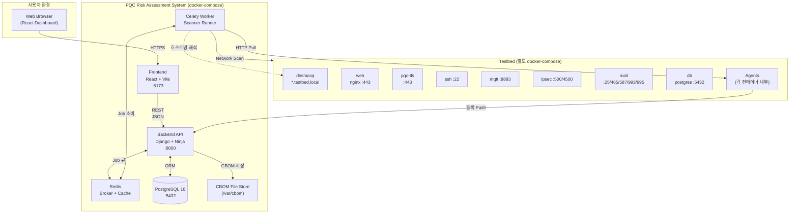
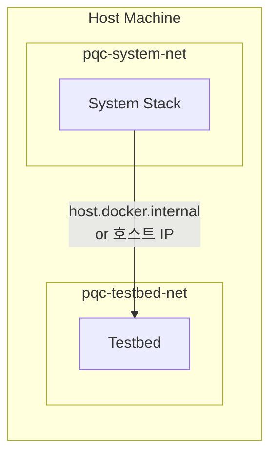
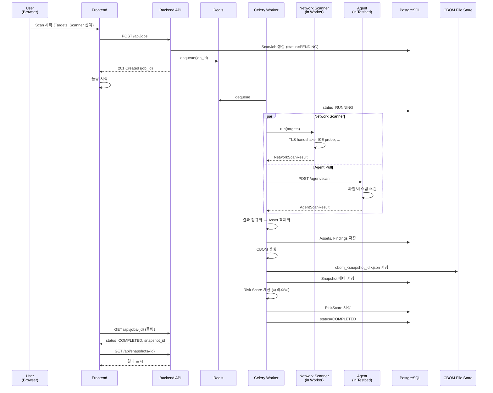
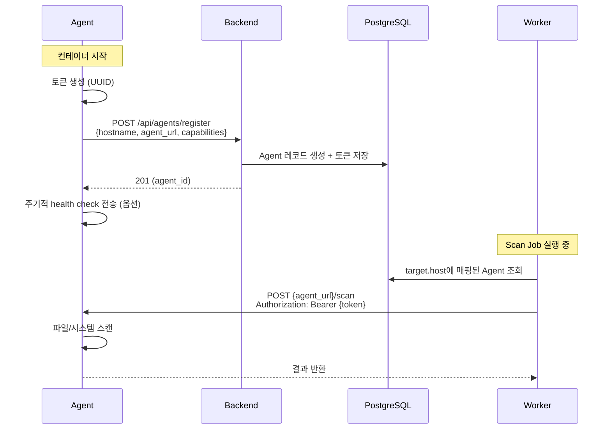

# 01. 시스템 아키텍처 (Architecture)

## 1.1 전체 컴포넌트 구조



## 1.2 배포 토폴로지 (D-01)

시스템 스택과 테스트베드는 **완전히 분리된 docker-compose 프로젝트**로 운영된다.

### 1.2.1 네트워크 분리 원칙

- **시스템 스택**: 자체 docker-compose에서 내부 네트워크 `pqc-system-net` 생성
- **테스트베드**: 별도 docker-compose에서 내부 네트워크 `pqc-testbed-net` 생성
- **연결 방식**: 테스트베드의 모든 서비스 포트와 dnsmasq(53/UDP)를 호스트 머신에 노출 → 시스템 스택은 호스트 IP로 접근



### 1.2.2 호스트네임 해석 (D-17)

테스트베드 내부에 **dnsmasq 컨테이너**를 띄워 `*.testbed.local` 영역의 A 레코드를 제공한다.

- 테스트베드 docker-compose에서 dnsmasq는 호스트의 5353/UDP 포트로 노출 (53은 호스트 OS와 충돌 가능)
- 시스템 스택의 Backend/Worker 컨테이너는 환경변수 `DNS_RESOLVER=host.docker.internal:5353`로 dnsmasq를 resolver로 사용
- 또는 Worker가 직접 dnsmasq를 조회하여 호스트네임을 IP로 변환

**dnsmasq 설정 예시**:
```
address=/web.testbed.local/172.20.0.10
address=/pqc-tls.testbed.local/172.20.0.11
address=/ssh.testbed.local/172.20.0.12
address=/mqtt.testbed.local/172.20.0.13
address=/ipsec.testbed.local/172.20.0.14
address=/mail.testbed.local/172.20.0.15
address=/db.testbed.local/172.20.0.16
```

> 상세 호스트/IP 매핑은 `02-testbed.md` 참고.

## 1.3 컴포넌트 책임 (Responsibility)

| 컴포넌트 | 책임 |
|---|---|
| **Frontend** | UI 렌더링, 사용자 인터랙션, REST 호출, Job 폴링 |
| **Backend API** | REST 엔드포인트 제공, DB CRUD, Job 큐잉, Agent 등록/트리거 라우팅 |
| **Celery Worker** | Scan Job 비동기 실행 (Network Scanner 직접 수행, Agent에 Pull 요청) |
| **Redis** | Celery broker, 캐시 (디스커버리 결과 임시 저장 등) |
| **PostgreSQL** | 영구 데이터 저장 (Targets, Assets, Snapshots 메타, Jobs, Risk 평가 등) |
| **CBOM File Store** | 큰 CBOM JSON 원본 저장 (DB에는 메타와 경로만) |
| **Agent** | 테스트베드 컨테이너 내부에서 파일/시스템 스캔 수행, 결과를 Worker에 응답 |
| **dnsmasq** | 테스트베드 호스트네임 해석 |

## 1.4 데이터 흐름 (Data Flow)

### 1.4.1 Scan Job 실행 흐름



### 1.4.2 Agent 등록/트리거 흐름 (D-07, D-15)

Agent는 **Hybrid 모델**로 동작한다 (14c).

- **등록(Push)**: Agent가 시작 시 자기 자신을 백엔드에 등록 (`POST /api/agents/register`)
- **트리거(Pull)**: Worker가 등록된 Agent에 작업 요청 (`POST {agent_url}/scan`)



> Agent 인증은 D-15에 따라 등록 시 발급되는 토큰을 사용 (15c).

## 1.5 보안 모델

### 1.5.1 인증 (Authentication)

| 통신 | 인증 방식 |
|---|---|
| Browser ↔ Frontend | 없음 (싱글 유저, D-04) |
| Frontend ↔ Backend | 없음 (싱글 유저, D-04) |
| Worker ↔ Agent | Bearer Token (Agent 등록 시 발급, 15c) |
| Agent → Backend (등록) | 사전 공유 Bootstrap 토큰 (환경변수) |

### 1.5.2 권한 (Authorization)

본 시스템은 싱글 유저 가정으로 별도 권한 모델을 두지 않는다. 모든 API는 동일 사용자가 호출한다.

### 1.5.3 데이터 보호

- DB는 시스템 docker-compose 내부 네트워크에만 노출 (외부 미노출)
- CBOM File Store는 컨테이너 볼륨, 호스트 미노출
- Agent 통신은 평문 HTTP 허용 (테스트베드 내부 한정), TLS 옵션은 v2

## 1.6 확장성 고려

본 시스템은 캡스톤 데모 규모이지만, 다음 확장점을 명세에 반영한다.

| 확장점 | 현재 | 향후 |
|---|---|---|
| 스캐너 추가 | 4종 (Network, Agent-File, Agent-System, Cert) | 플러그인 인터페이스로 추가 가능 (`04-scanner.md`) |
| LLM Provider | Mock | 환경변수로 OpenAI/Anthropic/Ollama 교체 (D-10) |
| 위험도 모델 | 휴리스틱 | 사용자 정의 가중치 UI (`06-risk-model.md`) |
| Migration 실행 | 권고안만 | D2 단계에서 실제 전환 실행 |

## 1.7 비기능 요구사항 (NFR)

| 항목 | 목표 |
|---|---|
| 동시 Scan Job | 최대 3개 (Worker 동시성) |
| 단일 Job 완료 시간 | 테스트베드 9개 서비스 풀스캔 기준 5분 이내 |
| API p95 응답 시간 | 200ms 이하 (스캔 트리거 제외) |
| CBOM 단일 스냅샷 크기 | 10MB 이하 가정 |
| 데이터 보관 기간 | 무제한 (사용자 수동 삭제) |
| 브라우저 호환 | Chrome 120+, Firefox 120+, Safari 17+ |
