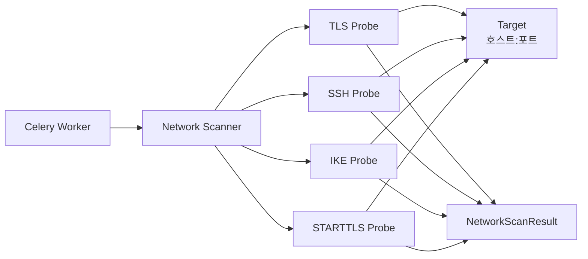
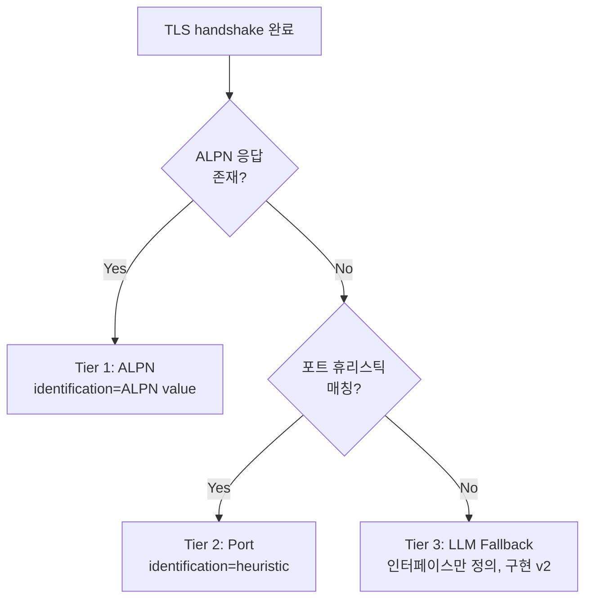

# 03. Network Scanner 명세

## 3.1 개요

Network Scanner는 본 시스템의 **기본(필수) 식별 경로**다. 외부 시점에서 Target에 네트워크 프로브를 보내어 응답으로부터 암호자산을 추출한다. Agent 협조 없이 동작하므로 모든 환경에서 가용하다.



## 3.2 책임

- Target에 대한 프로토콜별 프로브 수행
- 응답으로부터 raw 메타데이터 추출 (cipher suite ID, 인증서 DER 바이트, IKE SA proposal 등)
- 추출된 메타데이터를 정규화된 `NetworkScanResult` 객체로 반환
- **자산 객체 생성과 CBOM 변환은 후속 단계 (Asset Identification Engine)** 에서 수행

> 본 문서는 **무엇을 어떻게 추출하는지**까지 정의하고, 추출된 데이터로 자산을 만드는 로직은 `05-cbom-schema.md`에 명세한다.

## 3.3 입력 / 출력

### 3.3.1 입력: Target

```python
@dataclass
class Target:
    id: int
    host: str            # 호스트네임 (예: "web.testbed.local")
    ip: str | None       # 해석된 IP (옵션, 없으면 Scanner가 해석)
    port: int
    protocol: ProtocolHint   # TLS | SSH | IKE | SMTP | IMAP | POP3 | UNKNOWN
    sni: str | None      # SNI (없으면 host 사용, 25b)
    transport: Transport # TCP | UDP
    timeout_sec: int = 10
```

### 3.3.2 출력: NetworkScanResult

```python
@dataclass
class NetworkScanResult:
    target_id: int
    scanner: str               # "network"
    started_at: datetime
    finished_at: datetime
    status: ScanStatus         # SUCCESS | PARTIAL | TIMEOUT | UNREACHABLE | ERROR
    error: str | None

    # 프로토콜별 raw findings (해당하는 것만 채워짐)
    tls: TlsFinding | None
    ssh: SshFinding | None
    ike: IkeFinding | None
    starttls: StarttlsFinding | None

    # 프로토콜 식별 결과 (16-5)
    protocol_identification: ProtocolIdentification
```

## 3.4 프로브 매트릭스

Target의 `protocol` 힌트에 따라 다음 프로브가 실행된다.

| Hint | 사용 프로브 | 비고 |
|---|---|---|
| `TLS` | TLS Probe | 일반 TLS 서버 (web, pqc-tls, mqtt, db, mail-implicit) |
| `SSH` | SSH Probe | SSH 서버 |
| `IKE` | IKE Probe | IPsec/IKEv2 게이트웨이 |
| `SMTP` | STARTTLS Probe (SMTP) → TLS Probe | mail:25, mail:587 |
| `IMAP` | STARTTLS Probe (IMAP) → TLS Probe | mail:143 (옵션, 본 테스트베드 미포함) |
| `POP3` | STARTTLS Probe (POP3) → TLS Probe | mail:110 (옵션, 본 테스트베드 미포함) |
| `UNKNOWN` | TLS Probe → 실패 시 SSH Probe → 실패 시 banner grab | CIDR 디스커버리에서 발견된 미분류 포트 |

## 3.5 TLS Probe

### 3.5.1 동작

1. **TCP 연결**: `target.ip:target.port` (`target.ip`가 없으면 호스트네임 해석)
2. **ClientHello 전송**:
   - SNI = `target.sni` (없으면 `target.host`)
   - ALPN = `["h2", "http/1.1", "mqtt", "imap", "pop3", "smtp"]` (16-5 Tier 1)
   - 지원 cipher suites: TLS 1.0 ~ 1.3 전체 식별 가능 범위 (양자취약 포함, 식별 목적)
   - 지원 supported_groups: classical 전체 + PQC hybrid (`X25519MLKEM768` 등)
   - 지원 signature_algorithms: classical 전체 + PQC (`mldsa65` 등)
3. **ServerHello 분석**:
   - 선택된 TLS 버전
   - 선택된 cipher suite
   - 선택된 supported_group / key_share
   - 선택된 signature_algorithm
   - ALPN 응답
   - 인증서 체인 (Certificate 메시지에서 DER 바이트 그대로 보관)
4. **추가 프로브 (옵션)**: 같은 Target에 대해 다른 ClientHello로 재시도하여 cipher suite 다양성 추출
   - 1회차: 기본 ClientHello → 서버 선호 cipher suite 확인
   - 2회차: 기본에서 1회차 선택 cipher 제외 → 차선 cipher 확인
   - 최대 N회 (기본 N=3, 설정 가능)

### 3.5.2 출력: TlsFinding

```python
@dataclass
class TlsFinding:
    negotiated: list[TlsHandshakeRecord]  # N회차 결과
    certificate_chain: list[bytes]        # DER bytes, leaf 먼저
    alpn_selected: str | None
    sni_used: str

@dataclass
class TlsHandshakeRecord:
    attempt: int
    tls_version: str             # "TLS 1.2", "TLS 1.3"
    cipher_suite: str            # 표준 명칭, 예: "TLS_AES_256_GCM_SHA384"
    cipher_suite_id: int         # IANA 코드, 예: 0x1302
    key_exchange_group: str | None  # "X25519", "ML-KEM-768", "X25519MLKEM768"
    signature_algorithm: str | None # "rsa_pss_rsae_sha256", "ecdsa_secp256r1_sha256", "mldsa65"
```

### 3.5.3 인증서 처리

- DER 바이트 그대로 `certificate_chain`에 보관
- 파싱은 후속 단계 (Asset Identification)에서 수행하지만, Network Scanner는 **체인 순서 보존** 책임만 진다 (RFC 5246: leaf → intermediate → root, 단 self-signed root는 누락 가능)
- 체인의 모든 인증서가 별도 자산이 됨 (D-13, 21b)

### 3.5.4 라이브러리 후보

- 기본: Python `ssl` 모듈 (제한적, classical만)
- 권장: `cryptography` + `pyOpenSSL` 또는 `tlslite-ng`
- PQC: **OQS Provider 빌드의 OpenSSL** 을 subprocess로 호출 (`openssl s_client -connect ... -groups X25519MLKEM768`) 또는 Python binding (`oqs-python`)
- 결정사항: 기본 구현은 `cryptography` + `tlslite-ng`, PQC 협상이 필요한 경우 OQS OpenSSL subprocess 폴백

## 3.6 SSH Probe

### 3.6.1 동작

SSH 프로토콜은 연결 직후 **버전 문자열**과 **KEX_INIT** 메시지를 교환한다. 인증까지 진행하지 않고 KEX_INIT 단계에서 종료해도 모든 알고리즘 정보를 얻을 수 있다.

1. **TCP 연결**: `target.ip:target.port`
2. **버전 문자열 수신**: 예: `SSH-2.0-OpenSSH_9.6\r\n`
3. **클라이언트 버전 전송**: `SSH-2.0-PQC-RAS-Scanner_1.0\r\n`
4. **KEX_INIT 수신**: 서버가 지원하는 알고리즘 리스트 추출
   - `kex_algorithms`
   - `server_host_key_algorithms`
   - `encryption_algorithms_server_to_client` / `client_to_server`
   - `mac_algorithms_*`
   - `compression_algorithms_*`
5. **KEX_INIT 전송 후 즉시 연결 종료** (KEX 진행 안 함)
6. **(옵션) HostKey 추출**: 추가 연결로 KEX를 1단계만 진행해 서버 호스트 공개키 획득 (RSA / ECDSA / Ed25519 어느 것이 활성인지)

### 3.6.2 출력: SshFinding

```python
@dataclass
class SshFinding:
    server_version_string: str         # "SSH-2.0-OpenSSH_9.6"
    kex_algorithms: list[str]
    server_host_key_algorithms: list[str]
    encryption_algorithms_s2c: list[str]
    encryption_algorithms_c2s: list[str]
    mac_algorithms_s2c: list[str]
    mac_algorithms_c2s: list[str]
    host_keys: list[SshHostKey]        # 옵션, 추가 프로브 시

@dataclass
class SshHostKey:
    algorithm: str                     # "ssh-rsa", "ecdsa-sha2-nistp256", "ssh-ed25519"
    public_key_blob: bytes             # SSH wire format
    fingerprint_sha256: str            # base64 with prefix "SHA256:"
```

### 3.6.3 라이브러리 후보

- `paramiko`: 직접적이지만 KEX_INIT 단계만 잘라내기 어려움
- **권장: 직접 구현** — SSH 와이어 프로토콜이 단순하고, KEX_INIT까지만이면 100줄 내외
- 또는 `ssh-audit` 라이브러리 (Python)의 내부 사용

## 3.7 IKE Probe

### 3.7.1 동작

IKEv2의 첫 번째 교환인 **IKE_SA_INIT** 만 수행해 SA Proposal을 추출한다. 인증 단계까지 진행할 필요 없다.

1. **UDP 패킷 송신** (포트 500 또는 4500):
   - IKE Header (IKEv2)
   - SA Payload: 양자취약/PQC 후보 transform 모두 포함하는 다중 proposal
     - Encryption: AES-CBC-128/256, AES-GCM-128/256, ChaCha20-Poly1305
     - PRF: HMAC-SHA1/256/384/512
     - Integrity: HMAC-SHA1/256/384/512
     - DH Group: 14, 15, 16, 19, 20, 21, 31 (X25519), 32 (X448), 그리고 PQC hybrid 후보 (RFC 9242 등)
   - KE Payload: 클라이언트 측 DH 공개값 (예: Group 14 modp2048)
   - Nonce Payload
2. **응답 수신**:
   - 서버가 선택한 transforms (서버 선호 값을 반영)
   - 서버 KE Payload (DH 그룹 식별 가능)
3. **IKE_AUTH 진행 안 함** — 응답만 받고 종료

### 3.7.2 NAT-T 처리

- 포트 500 응답이 없으면 4500/UDP로 NAT-T 형식 (IKE 메시지 앞에 4바이트 0x00 넣음) 으로 재시도

### 3.7.3 출력: IkeFinding

```python
@dataclass
class IkeFinding:
    responder_spi: bytes
    chosen_proposal: IkeProposal
    all_offered_proposals: list[IkeProposal]   # 응답 파싱 가능 시
    server_ke_dh_group: int                    # KE Payload에서

@dataclass
class IkeProposal:
    proposal_num: int
    encryption: list[str]   # ["AES-GCM-256"]
    prf: list[str]
    integrity: list[str]
    dh_group: list[str]     # ["MODP_2048", "ECP_256", "CURVE25519"]
```

### 3.7.4 라이브러리 후보

- **`scapy`** 의 `IKEv2` 레이어 — 패킷 작성/파싱 모두 지원, 권장
- 직접 구현: 가능하지만 IKE 패킷 구조가 복잡함

## 3.8 STARTTLS Probe

평문으로 시작해 명령으로 TLS로 업그레이드되는 프로토콜용. 본 테스트베드에서는 **SMTP STARTTLS (포트 25, 587)** 가 대상.

### 3.8.1 SMTP STARTTLS 동작

1. TCP 연결
2. 서버 banner 수신 (`220 mail.testbed.local ESMTP`)
3. `EHLO scanner.local\r\n` 전송
4. 응답에서 `250-STARTTLS` 라인 확인 → STARTTLS 지원 여부 기록
5. `STARTTLS\r\n` 전송
6. `220 Ready to start TLS` 수신
7. **이 시점부터 TLS 핸드셰이크 시작** → 이후는 TLS Probe 로직 그대로 호출
8. 결과를 `StarttlsFinding`에 래핑

### 3.8.2 출력: StarttlsFinding

```python
@dataclass
class StarttlsFinding:
    upper_protocol: str            # "SMTP", "IMAP", "POP3"
    server_banner: str
    starttls_advertised: bool
    starttls_succeeded: bool
    tls: TlsFinding | None         # STARTTLS 성공 시 TLS Probe 결과
```

## 3.9 프로토콜 식별 (16-5)

ServerHello의 ALPN 응답이 비어있거나 표준에 없는 프로토콜인 경우, 다음 단계로 폴백한다.



### 3.9.1 포트 휴리스틱 테이블

| 포트 | 추정 프로토콜 |
|---|---|
| 443 | HTTPS |
| 8883 | MQTT |
| 5432 | PostgreSQL |
| 465 | SMTPS |
| 993 | IMAPS |
| 995 | POP3S |
| 22 | SSH |
| 500, 4500 | IKE/IPsec |

### 3.9.2 출력: ProtocolIdentification

```python
@dataclass
class ProtocolIdentification:
    tier: int                # 1=ALPN, 2=Port, 3=LLM
    protocol: str            # "HTTPS", "MQTT", "PostgreSQL", "UNKNOWN" 등
    confidence: float        # 0.0 ~ 1.0
    evidence: dict           # {"alpn": "h2"} 또는 {"port": 8883} 또는 {"llm_reason": "..."}
```

| Tier | confidence 기본값 |
|---|---|
| 1 (ALPN) | 1.0 |
| 2 (Port) | 0.7 |
| 3 (LLM) | LLM 응답에 따라 (mock에서는 0.5 고정) |

### 3.9.3 LLM Fallback 인터페이스 (D-10, 18c)

LLM 호출은 **인터페이스만 정의**, 구현은 mock으로 처리한다.

```python
class LlmProtocolIdentifier(Protocol):
    def identify(
        self,
        port: int,
        tls_version: str,
        cipher_suite: str,
        cert_san: list[str],
        cert_cn: str | None,
        first_response_bytes: bytes | None,
    ) -> ProtocolIdentification: ...
```

기본 구현은 `MockLlmProtocolIdentifier`로 `("UNKNOWN", 0.0)`을 반환한다. v2에서 실제 LLM provider 연동.

## 3.10 동시성 / 성능

- Network Scanner는 **Target 단위 병렬 실행** (Celery 동시성 N=3, NFR 기준)
- 단일 Target 내 프로브들은 순차 실행 (TLS 재시도 N회 등)
- 타임아웃: TCP connect 5s, handshake 10s, IKE UDP 응답 5s (NAT-T 폴백 포함 총 10s)

## 3.11 에러 처리

| 상황 | 처리 |
|---|---|
| 호스트 해석 실패 | `status=UNREACHABLE`, `error="DNS resolution failed: ..."` |
| TCP 연결 실패 (Connection refused) | `status=UNREACHABLE` |
| TCP 연결 타임아웃 | `status=TIMEOUT` |
| TLS handshake 실패 (서버가 지원 cipher 없음) | `status=PARTIAL`, `error="No common cipher"` — Target은 등록된 자산이 있을 수 있으므로 Job 자체는 계속 |
| 인증서 파싱 실패 | `status=PARTIAL`, raw bytes는 보관, 후속 Asset Identification에서 인증서만 누락 처리 |
| IKE 응답이 NO_PROPOSAL_CHOSEN | `status=PARTIAL`, 제안한 transform이 너무 좁은 경우. 다음 프로브 실행 |
| 의도치 않은 예외 | `status=ERROR`, full stack trace를 `error`에 |

## 3.12 보안 / 운영 고려

- Network Scanner는 **read-only**: Target에 어떠한 쓰기 작업도 하지 않음
- 동일 Target에 대한 연속 스캔 빈도 제한: 기본 60초 쿨다운 (남용 방지, 운영 옵션)
- Scanner의 클라이언트 식별: TLS ClientHello SNI/User-Agent 등에 `pqc-ras-scanner` 시그니처 포함 (정직성)
