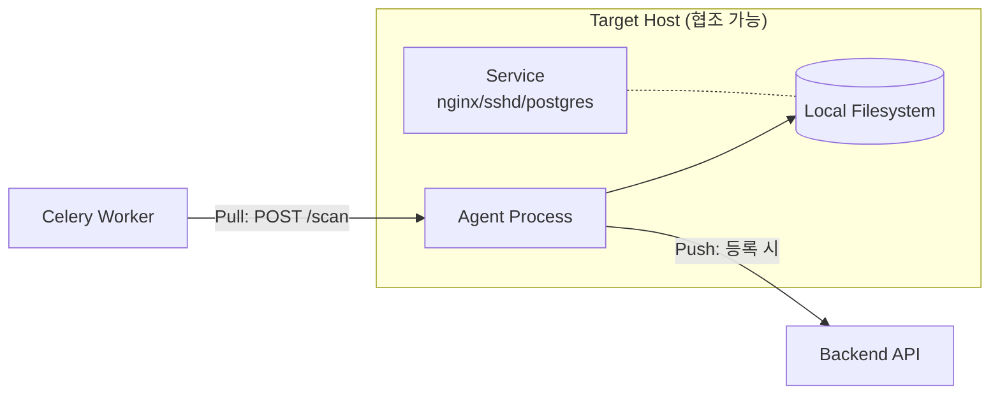
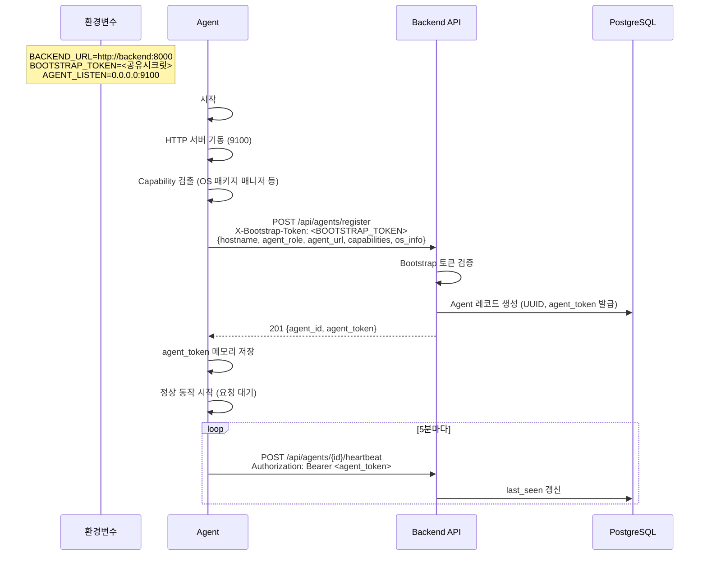
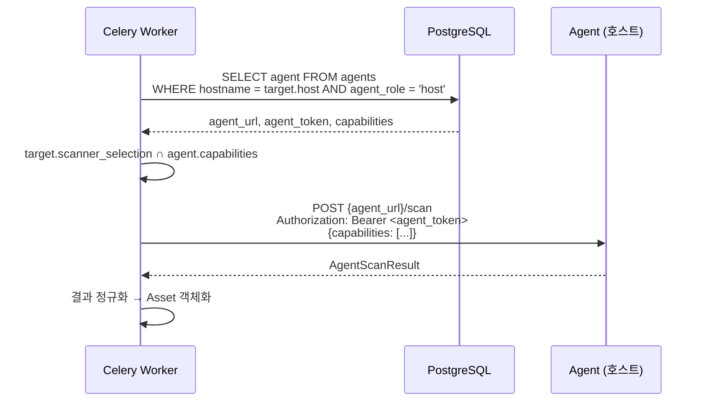

# 04. Agent 명세 (옵션 Capability)

## 4.1 개요

Agent는 본 시스템의 **옵션 capability**다. 평가 대상 호스트에 협조적으로 배포될 수 있는 경우 한정으로 사용된다. Agent 역할은 두 가지다. Host Agent는 Network Scanner로 식별 불가능한 자산(시스템 CA 저장소, 미사용 키, 설정 파일 정책 등)을 추가로 발견하고, Discovery Agent는 특정 네트워크 세그먼트 안에서 CIDR/IP/domain 탐색을 실행한다.



## 4.2 운영 모델

| 항목 | 값 |
|---|---|
| 통신 모델 | **Hybrid (14c)**: 기동 시 Push 자기등록, 작업은 Pull 트리거 |
| 인증 | 등록 시 발급 토큰 + Bootstrap 토큰 (15c) |
| 호환성 | Linux x86_64 (Debian/Ubuntu/Alpine/RHEL 계열). 본 캡스톤은 Alpine + Debian 기반 컨테이너만 검증 |
| 배포 단위 | 컨테이너 내부 멀티 프로세스 (테스트베드 한정). 실 환경에서는 systemd 서비스로 가정 (명세 외) |
| 권한 | 스캔 대상 경로에 대한 read 권한만 필요. 쓰기 불필요 |

| 역할 | `agent_role` | 설명 |
|---|---|---|
| Host Agent | `host` | 자기 호스트 내부 crypto asset 탐색 |
| Discovery Agent | `discovery` | 배치된 네트워크 위치에서 CIDR/IP/domain 후보 엔드포인트 탐색 |

## 4.3 Agent 책임

- 자기 자신을 백엔드에 등록하고 토큰을 보관
- Worker로부터 Pull 요청을 받으면 지정된 스캔 작업 수행
- 결과를 Worker에 직접 응답 (Worker로부터 온 HTTP 요청에 대한 응답으로)
- Health check 엔드포인트 제공

Agent는 **데이터를 자체 보관하지 않는다**. 모든 결과는 응답으로만 돌려주고 잊는다 (stateless 작업 모델).

## 4.4 Agent의 Scan Capability

| Capability | 설명 |
|---|---|
| `agent.cert_store` | 시스템 CA 저장소 인증서 수집 (`/etc/ssl/certs/`, `/etc/pki/...` 등 OS별 표준 경로) |
| `agent.pkg_keyring` | 패키지 리포지토리 키 수집 (`/etc/apt/keyrings/`, `/etc/apk/keys/`, `/etc/pki/rpm-gpg/`) |
| `agent.ssh_userkey` | `/home/*/.ssh/`, `/root/.ssh/` 사용자 키 + `authorized_keys` |
| `agent.ssh_config` | `/etc/ssh/sshd_config`의 알고리즘 정책 라인 |
| `agent.keystore` | PKCS#12 (`*.p12`, `*.pfx`), Java Keystore (`*.jks`) 파일 발견 + 메타데이터 추출 |
| `agent.app_cert_files` | 사전 정의된 애플리케이션 인증서 경로의 파일 (`/etc/nginx/ssl/`, `/var/lib/postgresql/`) |
| `agent.private_key_files` | 개인키 파일(`*.key`, `*.pem`, `*.pkcs8`)의 알고리즘, 키 길이, 공개키 fingerprint 수집. 개인키 원문은 응답/저장하지 않음 |
| `agent.app_config` | 애플리케이션 설정 파일 내 알고리즘 정책과 인증서/키 참조 경로 (`nginx.conf`, `postgresql.conf`, `postfix main.cf` 등) |

각 Capability는 Agent에서 활성/비활성 가능 (환경변수로). 등록 시 자기가 가진 Capability 목록을 백엔드에 알린다.
Host Agent는 개인키 파일을 발견하더라도 원문을 저장하거나 전송하지 않고 `path`, `algorithm`, `key_size_bits`, `fingerprint_sha256`, `in_use`, `dormant` 같은 메타데이터만 반환한다.

## 4.5 Agent 등록 흐름

### 4.5.1 부트스트랩



### 4.5.2 Bootstrap 토큰 (15c 보강)

- **Bootstrap 토큰**: 시스템 백엔드의 환경변수 `AGENT_BOOTSTRAP_TOKEN`으로 주입. 같은 값을 테스트베드 docker-compose의 `BOOTSTRAP_TOKEN`에도 주입하여 Agent들이 알게 함
- **Agent 토큰**: 백엔드가 Agent별로 발급하는 UUID. 등록 응답으로 1회만 전달, 이후 Agent ↔ Worker/Backend 통신 시 `Authorization: Bearer <agent_token>` 사용
- 두 토큰은 분리: Bootstrap 토큰은 등록만, Agent 토큰은 운영 중 통신용

## 4.6 Agent HTTP API

Agent는 백엔드/Worker에게 다음 엔드포인트를 제공한다.

### 4.6.1 `GET /healthz`

| 항목 | 값 |
|---|---|
| 인증 | 없음 |
| 응답 | `200 {"status": "ok", "agent_id": "...", "uptime_sec": 1234}` |

### 4.6.2 `GET /capabilities`

| 항목 | 값 |
|---|---|
| 인증 | Bearer agent_token |
| 응답 | `{"capabilities": ["agent.cert_store", "agent.ssh_config", ...]}` |

### 4.6.3 `POST /scan`

| 항목 | 값 |
|---|---|
| 인증 | Bearer agent_token |
| 요청 | `{"capabilities": ["agent.cert_store", "agent.ssh_userkey"], "options": {...}}` |
| 응답 | `200 AgentScanResult` |
| 시간 | 동기 처리. 단일 호스트 스캔 5분 이내 가정 |

### 4.6.4 `POST /discover`

Discovery Agent 전용 API다. Worker가 탐색 작업의 `executor_type=agent`와 `agent_id`를 확인한 뒤 해당 Agent에 탐색 범위를 전달한다.

| 항목 | 값 |
|---|---|
| 인증 | Bearer agent_token |
| 요청 | `{"scope_type": "cidr", "scope_value": "172.20.0.0/24", "ports": [443, 22]}` |
| 응답 | `200 {"endpoints": [{"host": "172.20.0.10", "port": 443, "transport": "TCP", "detected_protocol": "TLS"}]}` |
| 시간 | 동기 처리. 대역 크기와 포트 수에 따라 Worker timeout 정책 적용 |

### 4.6.5 요청/응답 스키마

#### 요청 본문

```json
{
  "capabilities": ["agent.cert_store", "agent.pkg_keyring", "agent.ssh_config"],
  "options": {
    "max_files_per_capability": 1000,
    "follow_symlinks": false,
    "include_paths": ["/etc/ssl/certs", "/etc/apt/keyrings"],
    "exclude_paths": ["/proc", "/sys"]
  }
}
```

#### 응답 본문 (`AgentScanResult`)

```json
{
  "agent_id": "uuid",
  "started_at": "2026-04-25T10:00:00Z",
  "finished_at": "2026-04-25T10:00:42Z",
  "status": "SUCCESS",
  "findings": [
    {
      "capability": "cert_store",
      "items": [
        {
          "path": "/etc/ssl/certs/ca-bundle.crt",
          "kind": "x509_certificate_bundle",
          "certificates": [
            {
              "der_b64": "MIIDxTCCAq2gA...",
              "sha256_fingerprint": "ab12...",
              "subject": "CN=Internal Root CA",
              "issuer": "CN=Internal Root CA",
              "not_before": "2024-01-01T00:00:00Z",
              "not_after": "2034-01-01T00:00:00Z",
              "public_key_algorithm": "RSA",
              "public_key_bits": 4096
            }
          ]
        }
      ]
    },
    {
      "capability": "ssh_config",
      "items": [
        {
          "path": "/etc/ssh/sshd_config",
          "kind": "ssh_config",
          "policy": {
            "KexAlgorithms": ["curve25519-sha256", "ecdh-sha2-nistp256", "diffie-hellman-group14-sha256"],
            "Ciphers": ["chacha20-poly1305@openssh.com", "aes256-gcm@openssh.com"],
            "MACs": ["hmac-sha2-512", "hmac-sha2-256"],
            "HostKeyAlgorithms": ["ssh-ed25519", "ecdsa-sha2-nistp256", "rsa-sha2-512"]
          }
        }
      ]
    }
  ],
  "errors": [
    {
      "capability": "keystore",
      "path": "/var/lib/postgresql/keystore.p12",
      "error": "Keystore is password-protected; metadata extracted via header parse only"
    }
  ]
}
```

### 4.6.5 에러 처리

| 상황 | 응답 |
|---|---|
| 인증 실패 | `401 {"error": "invalid_token"}` |
| 알 수 없는 capability 요청 | `400 {"error": "unsupported_capability", "details": ["foo"]}` |
| 파일 접근 권한 부족 | `findings`에는 빈 결과, `errors` 배열에 항목 추가 (스캔 자체는 SUCCESS) |
| 내부 예외 | `500 {"error": "internal", "trace_id": "..."}` |

## 4.7 Capability별 스캔 로직

### 4.7.1 `cert_store`

스캔 경로 (OS 자동 감지):

| OS | 경로 |
|---|---|
| Debian/Ubuntu | `/etc/ssl/certs/ca-certificates.crt` (PEM 번들), `/usr/local/share/ca-certificates/*.crt` |
| Alpine | `/etc/ssl/certs/`, `/usr/local/share/ca-certificates/*.crt` |
| RHEL/CentOS | `/etc/pki/ca-trust/source/anchors/`, `/etc/pki/tls/certs/ca-bundle.crt` |

각 인증서 파일/번들에서:
- DER 또는 PEM 디코딩
- 메타데이터 추출 (subject, issuer, validity, public key algorithm/size, signature algorithm)
- DER 바이트를 base64로 응답에 포함 (백엔드에서 재파싱 가능하도록)

### 4.7.2 `pkg_keyring`

| OS | 경로 | 형식 |
|---|---|---|
| Debian/Ubuntu | `/etc/apt/keyrings/*.gpg`, `/etc/apt/trusted.gpg.d/*.gpg`, `/etc/apt/trusted.gpg` | OpenPGP keyring (binary) |
| Alpine | `/etc/apk/keys/*.rsa.pub` | RSA public key (PEM) |
| RHEL/CentOS | `/etc/pki/rpm-gpg/RPM-GPG-KEY-*` | OpenPGP public key |

각 키에서:
- OpenPGP는 `python-gnupg` 또는 `pgpy`로 파싱 → packet 단위로 분해, 각 public key packet의 알고리즘/크기/fingerprint 추출
- RSA PEM은 `cryptography` 라이브러리로 파싱

### 4.7.3 `ssh_userkey`

스캔 경로:
- `/home/*/.ssh/authorized_keys`
- `/home/*/.ssh/*.pub`
- `/root/.ssh/authorized_keys`
- `/root/.ssh/*.pub`

`authorized_keys`의 각 라인 = 1개 공개키. 형식 `<algorithm> <base64-blob> [comment]`.

추출:
- algorithm (ssh-rsa, ecdsa-sha2-nistp256, ssh-ed25519, sk-ssh-ed25519@openssh.com 등)
- base64 blob → SSH wire format 디코딩 → 키 크기 (RSA modulus bits, EC curve name)
- fingerprint SHA256
- comment (사용자 식별용 메타데이터)

### 4.7.4 `ssh_config`

`/etc/ssh/sshd_config` 파싱:
- `KexAlgorithms`, `Ciphers`, `MACs`, `HostKeyAlgorithms`, `PubkeyAcceptedAlgorithms` 라인 추출
- `Match` 블록 내 override 라인은 컨텍스트와 함께 별도 항목으로
- 주석 처리된 라인은 무시

### 4.7.5 `keystore`

스캔: 사전 정의된 디렉터리에서 `*.p12`, `*.pfx`, `*.jks`, `*.keystore` 패턴 매칭 (옵션의 `include_paths` 기준)

추출:
- 파일 헤더만 파싱 (PKCS#12 magic, JKS magic) → 형식 식별
- 비밀번호 보호 시: 헤더만으로 키 슬롯 수, 알고리즘 일부 추출 가능 → `errors`에 "password-protected" 표기
- 비밀번호 없는 경우: 모든 entry를 순회하여 알고리즘/키 크기 메타데이터 추출

> 비밀번호 입력 UI는 본 캡스톤 범위 외. 비밀번호 보호 keystore는 헤더 정보만 보고한다.

### 4.7.6 `app_cert_files`

사전 정의된 경로:

| 애플리케이션 | 경로 |
|---|---|
| nginx | `/etc/nginx/ssl/`, `/etc/nginx/certs/`, `/etc/letsencrypt/live/*/` |
| postgres | `/var/lib/postgresql/data/server.crt`, `/var/lib/postgresql/data/server.key` (메타만) |
| postfix | `/etc/postfix/ssl/` |
| dovecot | `/etc/dovecot/ssl/` |

각 인증서 파일에서 `cert_store`와 동일한 메타데이터 추출.

### 4.7.7 `app_config`

| 애플리케이션 | 파일 | 추출 라인 |
|---|---|---|
| postgres | `postgresql.conf` | `ssl_ciphers`, `ssl_min_protocol_version`, `ssl_max_protocol_version`, `password_encryption` |
| nginx | `nginx.conf`, `conf.d/*.conf` | `ssl_protocols`, `ssl_ciphers`, `ssl_ecdh_curve` |
| postfix | `main.cf` | `smtpd_tls_protocols`, `smtpd_tls_ciphers`, `smtpd_tls_mandatory_protocols` |

## 4.8 Worker → Agent 통신

Worker가 Scan Job을 처리할 때, 각 Target에 매핑된 Host Agent가 등록되어 있고 `target.agent_enabled=true`이면 Agent를 호출한다.



### 4.8.1 매핑 규칙

- Target의 `host` 필드가 Host Agent의 `hostname`과 일치하면 매핑
- 동일 hostname이라도 `host`/`discovery` 역할별로 각각 1개 Agent 등록 가능
- Agent가 `last_seen`이 5분 이상 지난 상태면 stale로 간주, Worker는 Agent 호출을 건너뛰고 Network Scanner 결과만 사용

### 4.8.2 Scanner 선택과 Agent

Scan Job 생성 시 사용자가 체크박스로 선택한 스캐너 종류 중 Agent 관련 항목(예: `agent.cert_store`, `agent.ssh_config` 등)은 **해당 호스트에 Agent가 등록되어 있고 capability를 지원하는 경우에만** 실행된다. 그 외에는 조용히 skip되며 Job 결과 보고서에 "skipped: agent_unavailable" 같은 노트로 표기된다.

## 4.9 보안 / 운영 고려

| 항목 | 정책 |
|---|---|
| 통신 암호화 | 본 캡스톤은 평문 HTTP 허용 (테스트베드 내부망 한정). 운영 환경 가정에는 mTLS 권장이 명세 노트로 |
| 토큰 회전 | 본 캡스톤 미지원 (재등록으로 새 토큰). v2에서 회전 API |
| 권한 최소화 | Agent는 read-only 권한으로 동작. 컨테이너 내 user는 가능한 한 비-root |
| 자원 제한 | Agent CPU/메모리 제한 없음 (캡스톤 데모). 운영 환경에서는 cgroup 권장 노트 |
| 결과 크기 제한 | 응답 본문 50MB 이하 권장. 초과 시 `findings`를 capability별로 잘라 분할 응답 (옵션, v2) |

## 4.10 Agent 디렉터리 구조 (참고 구현 가이드)

```
testbed/agent/
├── Dockerfile          # 베이스 이미지 (alpine + python3)
├── requirements.txt
└── src/
    ├── main.py         # FastAPI 또는 Flask 앱 진입점
    ├── register.py     # 부팅 시 백엔드 등록
    ├── auth.py         # 토큰 검증
    ├── scanners/
    │   ├── cert_store.py
    │   ├── pkg_keyring.py
    │   ├── ssh_userkey.py
    │   ├── ssh_config.py
    │   ├── keystore.py
    │   ├── app_cert_files.py
    │   └── app_config.py
    └── schemas.py      # Pydantic 모델 (AgentScanResult 등)
```

> 이 구조는 권고 가이드이며, 명세 강제는 아니다.
