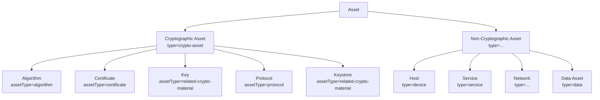

# 05. CBOM 스키마 명세

## 5.1 개요

본 시스템의 자산 데이터 모델은 **CycloneDX 1.6 CBOM** 사양을 기반으로 한다. CBOM은 Cryptography Bill of Materials의 약어로, 소프트웨어 구성요소 명세인 SBOM에 암호자산 표현을 더한 확장이다.

### 5.1.1 채택 사양

| 항목 | 값 |
|---|---|
| 기준 사양 | CycloneDX **1.6** (JSON 표현) |
| 참조 가이드 | OWASP CycloneDX Authoritative Guide to CBOM |
| 직렬화 형식 | JSON (XML 미지원) |
| 자체 확장 | `properties` 배열의 `internal:*` 네임스페이스로 표현 |

### 5.1.2 결정사항 정리

| 항목 | 결정 |
|---|---|
| CBOM 단위 | 1 Scan Job = 1 CBOM Snapshot (D-08, 5a) |
| 자산 카테고리 | Cryptographic + Non-Cryptographic 모두 포함 (D-12, 20a) |
| 인증서 체인 | leaf/intermediate/root 모두 별개 자산 (D-13, 21b) |
| 자산 식별자 | `bom-ref` (CycloneDX 표준), 시스템 내부적으로는 `Asset.id` (DB PK)와 분리 |
| 운영 컨텍스트 | `properties` 확장으로 표현 (Data sensitivity, Lifespan 등) |
| 자산 간 관계 | CycloneDX `dependencies` 배열 (체인, signedBy, usedBy 등) |

## 5.2 CBOM 문서 최상위 구조

```json
{
  "bomFormat": "CycloneDX",
  "specVersion": "1.6",
  "serialNumber": "urn:uuid:<uuid>",
  "version": 1,
  "metadata": {
    "timestamp": "2026-04-25T10:00:00Z",
    "tools": {
      "components": [
        {
          "type": "application",
          "name": "PQC Risk Assessment System",
          "version": "0.1.0",
          "vendor": "Team 양자택일"
        }
      ]
    },
    "properties": [
      {"name": "internal:scan_job_id", "value": "1234"},
      {"name": "internal:snapshot_id", "value": "5678"},
      {"name": "internal:targets", "value": "[\"web.testbed.local:443\", ...]"}
    ]
  },
  "components": [ ... ],
  "dependencies": [ ... ]
}
```

## 5.3 자산 분류 트리

본 시스템에서 다루는 자산은 다음과 같이 분류된다.



> CycloneDX의 `components[].type`은 표준 enum이며, 위 매핑은 본 시스템의 채택 정책이다.

## 5.4 Cryptographic Assets

### 5.4.1 공통 필드

모든 암호자산 컴포넌트는 다음 공통 필드를 가진다.

```json
{
  "type": "crypto-asset",
  "bom-ref": "<unique-id>",
  "name": "<human-readable name>",
  "cryptoProperties": {
    "assetType": "<algorithm | certificate | related-crypto-material | protocol>",
    ...
  },
  "evidence": {
    "occurrences": [
      {
        "location": "<URI 또는 경로>",
        "line": 0
      }
    ]
  },
  "properties": [
    {"name": "internal:source_scanner", "value": "<network | agent>"},
    {"name": "internal:discovered_at", "value": "<ISO timestamp>"},
    {"name": "internal:target_id", "value": "<target FK>"},
    {"name": "internal:quantum_vulnerable", "value": "<true | false | unknown>"}
  ]
}
```

### 5.4.2 Algorithm Asset

암호 알고리즘의 사용 인스턴스. 예: TLS handshake에서 협상된 cipher suite 안의 RSA 서명, ECDH 키 교환 등.

```json
{
  "type": "crypto-asset",
  "bom-ref": "alg-rsa-2048-tls-web",
  "name": "RSA-2048 (signature)",
  "cryptoProperties": {
    "assetType": "algorithm",
    "algorithmProperties": {
      "primitive": "signature",
      "parameterSetIdentifier": "rsaEncryption",
      "executionEnvironment": "software-plain-ram",
      "implementationPlatform": "x86_64",
      "certificationLevel": ["none"],
      "mode": "pkcs1v15",
      "padding": "pkcs1",
      "cryptoFunctions": ["sign", "verify"],
      "classicalSecurityLevel": 112,
      "nistQuantumSecurityLevel": 0
    },
    "oid": "1.2.840.113549.1.1.1"
  },
  "properties": [
    {"name": "internal:family", "value": "RSA"},
    {"name": "internal:key_size_bits", "value": "2048"},
    {"name": "internal:source_scanner", "value": "network"},
    {"name": "internal:quantum_vulnerable", "value": "true"}
  ]
}
```

`algorithmProperties` 필드는 CycloneDX 1.6 CBOM 표준이다. 주요 값:

| 필드 | 본 시스템에서 사용하는 값 예시 |
|---|---|
| `primitive` | `signature`, `key-agree`, `hash`, `kem`, `pke`, `block-cipher`, `stream-cipher`, `mac` |
| `parameterSetIdentifier` | 알고리즘 OID 또는 표준 명칭 (`rsaEncryption`, `id-ecPublicKey`, `ML-KEM-768`) |
| `cryptoFunctions` | `[encrypt, decrypt, sign, verify, encapsulate, decapsulate, keygen, keyderive, ...]` |
| `nistQuantumSecurityLevel` | 0 (양자취약) ~ 5. RSA/ECDSA/DH/ECDH는 0 |

### 5.4.3 Certificate Asset

X.509 인증서 또는 OpenPGP 공개키 인증서.

```json
{
  "type": "crypto-asset",
  "bom-ref": "cert-leaf-web-rsa2048",
  "name": "web.testbed.local (leaf)",
  "cryptoProperties": {
    "assetType": "certificate",
    "certificateProperties": {
      "subjectName": "CN=web.testbed.local,O=Test",
      "issuerName": "CN=Internal Intermediate CA",
      "notValidBefore": "2025-01-01T00:00:00Z",
      "notValidAfter": "2026-01-01T00:00:00Z",
      "signatureAlgorithmRef": "alg-rsa-pkcs1-sha256",
      "subjectPublicKeyRef": "key-rsa-2048-web-leaf",
      "certificateFormat": "X.509",
      "certificateExtension": "pem"
    }
  },
  "properties": [
    {"name": "internal:fingerprint_sha256", "value": "ab12cd34..."},
    {"name": "internal:chain_position", "value": "leaf"},
    {"name": "internal:san_dns", "value": "web.testbed.local,web-ec.testbed.local"},
    {"name": "internal:source_scanner", "value": "network"}
  ]
}
```

체인의 각 인증서는 별개 자산으로 등록되며, `dependencies` 배열에서 `provides` 또는 `dependsOn`으로 연결된다.

### 5.4.4 Key Asset

개인키/공개키. 주로 Agent가 발견하는 키 파일, 또는 인증서의 SubjectPublicKey에서 도출된 공개키.

```json
{
  "type": "crypto-asset",
  "bom-ref": "key-rsa-2048-web-leaf",
  "name": "RSA-2048 public key (web leaf cert)",
  "cryptoProperties": {
    "assetType": "related-crypto-material",
    "relatedCryptoMaterialProperties": {
      "type": "public-key",
      "id": "key-rsa-2048-web-leaf",
      "state": "active",
      "algorithmRef": "alg-rsa-2048",
      "size": 2048,
      "format": "DER",
      "securedBy": null
    }
  },
  "properties": [
    {"name": "internal:source_scanner", "value": "network"},
    {"name": "internal:embedded_in", "value": "cert-leaf-web-rsa2048"}
  ]
}
```

`type` 가능 값: `private-key`, `public-key`, `secret-key`, `key`, `seed`, `salt`, `nonce`, `iv`, `tag`, `digest`, `password`, `credential`, `token`, `other`, `unknown`.

### 5.4.5 Protocol Asset

TLS/SSH/IKE 프로토콜의 1회 사용 인스턴스. Network Scanner가 직접 식별한다.

```json
{
  "type": "crypto-asset",
  "bom-ref": "proto-tls13-web",
  "name": "TLS 1.3 @ web.testbed.local:443",
  "cryptoProperties": {
    "assetType": "protocol",
    "protocolProperties": {
      "type": "tls",
      "version": "1.3",
      "cipherSuites": [
        {
          "name": "TLS_AES_256_GCM_SHA384",
          "identifiers": ["0x1302"],
          "algorithms": ["alg-aes-256-gcm", "alg-sha-384"]
        }
      ],
      "cryptoRefArray": ["alg-x25519", "alg-rsa-pkcs1-sha256"]
    }
  },
  "properties": [
    {"name": "internal:host", "value": "web.testbed.local"},
    {"name": "internal:port", "value": "443"},
    {"name": "internal:alpn", "value": "h2"},
    {"name": "internal:protocol_identification_tier", "value": "1"},
    {"name": "internal:protocol_identification_value", "value": "HTTPS"},
    {"name": "internal:source_scanner", "value": "network"}
  ]
}
```

`protocolProperties.type` 가능 값: `tls`, `ssh`, `ipsec`, `ike`, `mqtt`, `smtp`, `imap`, `pop3`, `https`, `other`, `unknown`.

### 5.4.6 Keystore Asset

PKCS#12, JKS 등 다중 키 보관 파일. Agent의 `keystore` capability에서 발견.

```json
{
  "type": "crypto-asset",
  "bom-ref": "ks-pg-keystore",
  "name": "PostgreSQL keystore",
  "cryptoProperties": {
    "assetType": "related-crypto-material",
    "relatedCryptoMaterialProperties": {
      "type": "keystore",
      "format": "PKCS12",
      "state": "active"
    }
  },
  "evidence": {
    "occurrences": [{"location": "file:///var/lib/postgresql/keystore.p12"}]
  },
  "properties": [
    {"name": "internal:host", "value": "db.testbed.local"},
    {"name": "internal:password_protected", "value": "true"},
    {"name": "internal:entry_count", "value": "1"},
    {"name": "internal:source_scanner", "value": "agent"},
    {"name": "internal:agent_capability", "value": "keystore"}
  ]
}
```

## 5.5 Non-Cryptographic Assets

20a 결정에 따라 운영 컨텍스트 자산도 CBOM에 포함된다. 위험도 평가의 입력이 된다.

### 5.5.1 Host (Device)

```json
{
  "type": "device",
  "bom-ref": "host-web-testbed",
  "name": "web.testbed.local",
  "properties": [
    {"name": "internal:asset_class", "value": "host"},
    {"name": "internal:ip", "value": "172.20.0.10"},
    {"name": "internal:os", "value": "linux"},
    {"name": "internal:os_distribution", "value": "alpine:3.20"},
    {"name": "internal:agent_enabled", "value": "true"}
  ]
}
```

### 5.5.2 Service

```json
{
  "type": "service",
  "bom-ref": "svc-web-https",
  "name": "HTTPS @ web.testbed.local:443",
  "endpoints": ["https://web.testbed.local:443"],
  "properties": [
    {"name": "internal:asset_class", "value": "service"},
    {"name": "internal:protocol", "value": "HTTPS"},
    {"name": "internal:role", "value": "web-frontend"},
    {"name": "internal:external_exposure", "value": "internal"}
  ]
}
```

### 5.5.3 Data Asset

운영 컨텍스트(데이터 민감도, 보호 기간 등). Target 등록 시 사용자가 입력한 값이 여기 들어간다 (D-11, 19c+19b).

```json
{
  "type": "data",
  "bom-ref": "data-web-customer-info",
  "name": "Web 고객 정보",
  "properties": [
    {"name": "internal:asset_class", "value": "data"},
    {"name": "internal:sensitivity", "value": "high"},
    {"name": "internal:lifespan_years", "value": "10"},
    {"name": "internal:criticality", "value": "high"},
    {"name": "internal:user_provided", "value": "true"}
  ]
}
```

`internal:sensitivity`, `internal:criticality` 가능 값: `low`, `medium`, `high`, `critical`. `internal:lifespan_years`는 자연수.

## 5.6 자산 관계 (Dependencies)

CycloneDX `dependencies` 배열로 자산 간 관계를 표현한다.

```json
{
  "dependencies": [
    {
      "ref": "cert-leaf-web-rsa2048",
      "dependsOn": [
        "key-rsa-2048-web-leaf",
        "alg-rsa-pkcs1-sha256",
        "cert-intermediate-rsa4096"
      ]
    },
    {
      "ref": "cert-intermediate-rsa4096",
      "dependsOn": ["cert-root-rsa4096"]
    },
    {
      "ref": "proto-tls13-web",
      "dependsOn": [
        "alg-aes-256-gcm",
        "alg-sha-384",
        "alg-x25519",
        "cert-leaf-web-rsa2048"
      ]
    },
    {
      "ref": "svc-web-https",
      "dependsOn": ["proto-tls13-web", "host-web-testbed", "data-web-customer-info"]
    },
    {
      "ref": "host-web-testbed",
      "dependsOn": []
    }
  ]
}
```

### 5.6.1 관계 의미

본 시스템은 CycloneDX 표준 `dependsOn` 외에 다음 의미를 자체 컨벤션으로 둔다.

| 자산 A | 관계 | 자산 B | 의미 |
|---|---|---|---|
| Certificate | dependsOn | Key | 인증서가 공개키를 임베드 |
| Certificate | dependsOn | Algorithm | 서명 알고리즘 |
| Certificate (leaf) | dependsOn | Certificate (intermediate) | 체인 상위 |
| Protocol | dependsOn | Algorithm | 프로토콜이 사용한 알고리즘 |
| Protocol | dependsOn | Certificate | 프로토콜이 사용한 인증서 |
| Service | dependsOn | Protocol | 서비스가 노출한 프로토콜 |
| Service | dependsOn | Host | 서비스가 호스트에서 동작 |
| Service | dependsOn | Data | 서비스가 보호하는 데이터 |

> CycloneDX는 단일 `dependsOn` 관계만 정의하므로, 의미 구분은 시스템 내부 모델(DB Edge 테이블)에서 별도 컬럼으로 관리한다. CBOM export 시점에는 모두 `dependsOn`으로 평탄화된다.

## 5.7 자산 식별자 (`bom-ref`) 컨벤션

`bom-ref`는 CBOM 문서 내 유일해야 한다. 본 시스템의 명명 규칙:

| 자산 종류 | 패턴 | 예시 |
|---|---|---|
| Algorithm | `alg-<family>-<param>[-<variant>]` | `alg-rsa-2048`, `alg-mldsa-65` |
| Certificate | `cert-<position>-<host>-<keyalg>-<fingerprint8>` | `cert-leaf-web-rsa2048-ab12cd34` |
| Key | `key-<algfamily>-<size>-<context>` | `key-rsa-2048-web-leaf` |
| Protocol | `proto-<type><version>-<host>-<port>` | `proto-tls13-web-443` |
| Keystore | `ks-<host>-<basename>` | `ks-db-keystore-p12` |
| Host | `host-<hostname-slug>` | `host-web-testbed` |
| Service | `svc-<host>-<protocol>` | `svc-web-https` |
| Data | `data-<host>-<slug>` | `data-web-customer-info` |

> 슬래시, 콜론 등 URL 예약문자는 사용하지 않는다. 케이스는 lowercase로 통일.

## 5.8 `properties` 확장 네임스페이스

본 시스템은 `internal:*` 접두사를 자체 확장으로 예약한다. 표준 CBOM 사양과 충돌하지 않는다.

| 네임스페이스 | 용도 |
|---|---|
| `internal:` | 본 시스템 전용 메타데이터 |
| `cdx:` | CycloneDX 사양 자체 권고 (사용 시) |
| `risk:` | 위험도 평가 결과 (06-risk-model.md 참고) |

자주 쓰이는 `internal:*` 키 일람:

| 키 | 값 | 적용 자산 |
|---|---|---|
| `internal:source_scanner` | `network` / `agent` / `mixed` | 모든 암호자산 |
| `internal:discovered_at` | ISO 8601 timestamp | 모든 자산 |
| `internal:target_id` | DB Target FK | 발견 출처가 있는 자산 |
| `internal:quantum_vulnerable` | `true` / `false` / `unknown` | Algorithm, Certificate, Key |
| `internal:fingerprint_sha256` | hex string | Certificate, Key |
| `internal:chain_position` | `leaf` / `intermediate` / `root` | Certificate |
| `internal:host` | hostname | Protocol, Keystore, Service |
| `internal:port` | port number | Protocol, Service |
| `internal:asset_class` | `host` / `service` / `data` / `network` | Non-crypto |
| `internal:sensitivity` | `low/medium/high/critical` | Data |
| `internal:lifespan_years` | int | Data |
| `internal:criticality` | `low/medium/high/critical` | Data, Service |
| `internal:agent_enabled` | `true` / `false` | Host |
| `internal:agent_capability` | capability 이름 | Agent 발견 자산 |

## 5.9 CBOM Snapshot 모델 (D-08)

### 5.9.1 저장 정책

- DB(`cbom_snapshot` 테이블)에는 메타데이터만: `id`, `scan_job_id`, `created_at`, `asset_count`, `file_path`, `serial_number`
- CBOM JSON 원본은 `/var/cbom/<snapshot_id>.json`에 저장 (D-03 보강: 큰 JSON은 파일로)
- 스냅샷은 영구 보관 (사용자 수동 삭제 전까지)

### 5.9.2 Diff 계산 (17b)

두 스냅샷 간 변경사항을 계산한다.

```python
@dataclass
class CbomDiff:
    snapshot_a: int
    snapshot_b: int
    added: list[ComponentRef]      # B에만 있음
    removed: list[ComponentRef]    # A에만 있음
    modified: list[ComponentDiff]  # 양쪽에 있으나 변경됨
    unchanged_count: int

@dataclass
class ComponentRef:
    bom_ref: str
    type: str
    name: str

@dataclass
class ComponentDiff:
    bom_ref: str
    field_changes: dict[str, tuple[Any, Any]]   # {"properties.internal:port": ("443", "4443")}
```

- 자산 동일성 판정 키: 자산 종류별 자연 키
  - Certificate: `fingerprint_sha256`
  - Key: `algorithm + key blob hash`
  - Algorithm: `(family, parameter, mode)` 조합
  - Protocol: `(host, port, type, version)`
  - Host: `hostname`
  - Service: `(host, port, protocol)`
- `bom-ref`는 스냅샷마다 새로 생성될 수 있으므로 자연 키로 매칭 후 매핑 테이블 생성

## 5.10 검증 (Validation)

CBOM 생성 시 다음을 검증한다.

| 검증 항목 | 처리 |
|---|---|
| `serialNumber` UUID 유일성 | 생성 시 보장 |
| `bom-ref` 문서 내 중복 | 중복 시 suffix `-2`, `-3` 자동 부여 |
| `dependencies.dependsOn` 참조 무결성 | 미존재 ref 참조 시 경고 로그 + 해당 dependency 제거 |
| `cryptoProperties.assetType` enum | CycloneDX 1.6 enum 외 값은 `other`로 |
| 필수 필드 누락 | 누락 자산은 CBOM에 포함하지 않고 `errors` 로그에 |

생성된 CBOM은 CycloneDX 공식 JSON Schema (1.6)로 검증한다. 검증 실패 시 Snapshot의 `validation_errors` 필드에 기록.

## 5.11 Export 정책

| 형식 | 지원 |
|---|---|
| JSON (CycloneDX 1.6) | 기본, `/api/snapshots/{id}/export?format=json` |
| Pretty JSON (들여쓰기 2) | 옵션 `?pretty=1` |
| 필터링된 export | `?include_types=algorithm,certificate&min_risk=high` (옵션, v2) |

> XML, ProtoBuf 등은 v2.
