# 10. UX 플로우 명세

## 10.1 개요

본 문서는 사용자가 시스템과 상호작용하는 주요 플로우를 시퀀스 다이어그램으로 정의한다. 각 플로우는 9장(페이지)과 8장(API)을 연결하며, 사용자가 어떤 화면에서 어떤 액션을 통해 어떤 결과를 얻는지 단계별로 기술한다.

## 10.2 플로우 일람

| ID | 플로우 | 핵심 가치 |
|---|---|---|
| F1 | 첫 진입 — 빈 상태에서 시스템 사용 시작 | 온보딩, 비어있을 때의 안내 |
| F2 | CIDR 디스커버리 → Target 등록 | 자동 발견 기반 등록 |
| F3 | Target 직접 등록 | 명시적 등록 |
| F4 | 신규 스캔 실행 | 핵심 식별 작업 |
| F5 | Asset 탐색 및 상세 조회 | 발견된 자산 검토 |
| F6 | Risk Assessment + 가중치 조정 | 우선순위 도출 |
| F7 | Migration Plan 검토 + 보고서 생성 | 전환 권고 확인 |
| F8 | CBOM Snapshot Diff 비교 | 변경 추적 |
| F9 | Asset 컨텍스트 Override + 재계산 | 정확도 향상 |
| F10 | Agent 등록 흐름 (사용자 비개입) | 백그라운드 자동화 |

## 10.3 F1: 첫 진입 (Empty State Onboarding)

### 10.3.1 트리거

사용자가 처음 `/`를 방문. DB에 Snapshot/Target이 없는 상태.

### 10.3.2 시퀀스

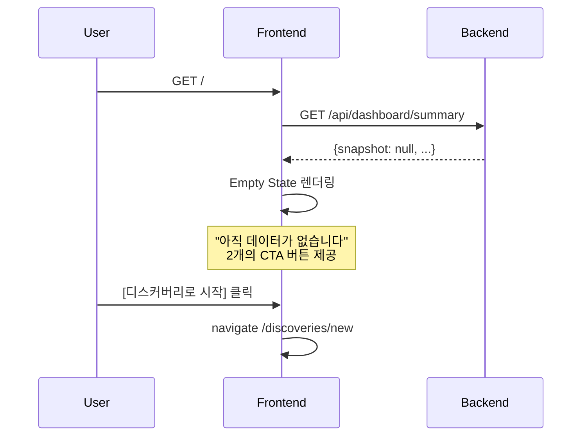

### 10.3.3 화면

```
┌──────────────────────────────────────────────────────────┐
│              👋 PQC Risk Assessment                       │
│                                                          │
│            아직 데이터가 없습니다.                          │
│            시작하려면 두 가지 방법 중 하나를 선택하세요.    │
│                                                          │
│   ┌────────────────────┐    ┌────────────────────┐      │
│   │  🔍 자동 발견       │    │  ➕ 직접 등록       │      │
│   │  네트워크 대역에서   │    │  알고 있는 호스트을  │      │
│   │  서비스를 자동       │    │  Target으로 등록    │      │
│   │  탐색합니다.         │    │  합니다.            │      │
│   │                    │    │                    │      │
│   │  [디스커버리 시작]   │    │  [Target 등록]      │      │
│   └────────────────────┘    └────────────────────┘      │
└──────────────────────────────────────────────────────────┘
```

### 10.3.4 특이사항

- 사이드바는 표시되지만, 빈 상태에서 클릭 시 각 페이지에 적절한 Empty State 표시
- "디스커버리 시작" → F2 진입
- "Target 등록" → F3 진입

## 10.4 F2: CIDR 디스커버리 → Target 등록

### 10.4.1 시퀀스

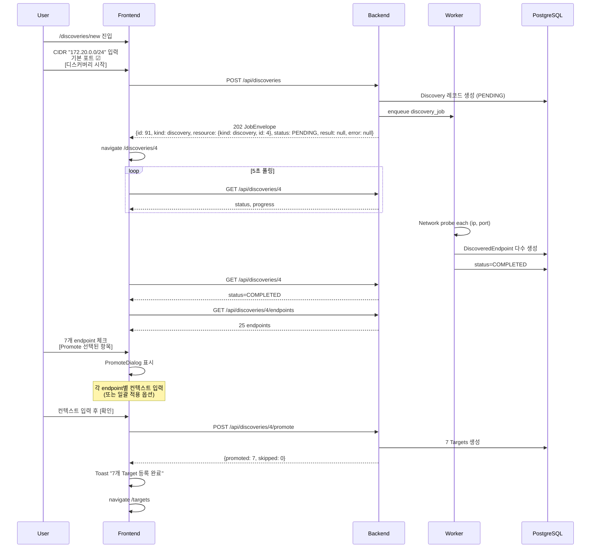

### 10.4.2 핵심 UX 결정

- **폴링 시작 시점**: 응답 받자마자 `/discoveries/{id}`로 이동하여 진행 화면 표시
- **결과 화면**: 진행 중에도 부분 결과(이미 발견된 endpoint)를 점진적으로 표시
- **Promote 다이얼로그**: 다중 선택 시 "모두 같은 컨텍스트 적용" 토글 → 한 번 입력으로 일괄 처리
- **빈 컨텍스트 허용**: 사용자가 입력하지 않으면 휴리스틱 추정 사용 (6.2.2~6.2.5)

## 10.5 F3: Target 직접 등록

### 10.5.1 시퀀스

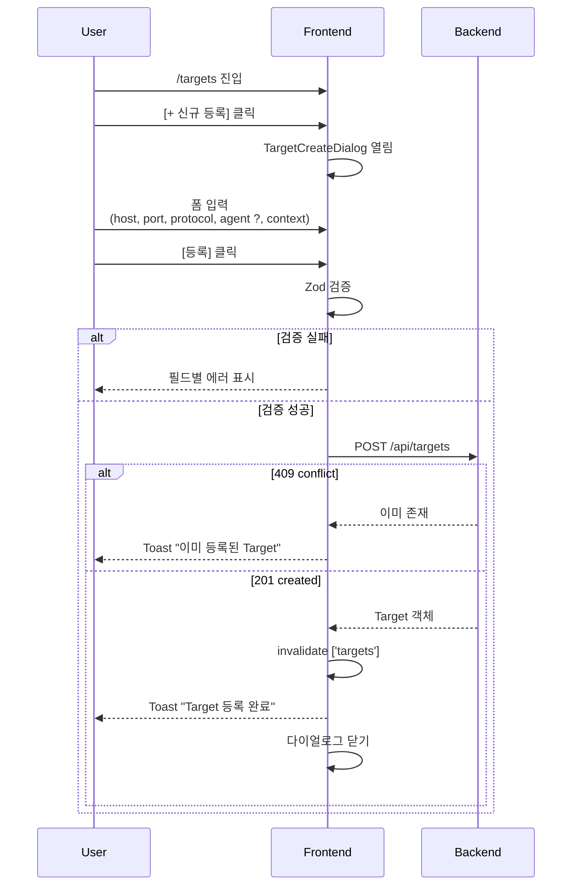

### 10.5.2 폼 단계

폼은 단일 화면이지만 시각적으로 3섹션:

1. **연결 정보** (필수)
   - Host, Port, Protocol Hint, SNI, Transport
2. **Agent 사용** (옵션)
   - Agent 사용 체크박스
   - 체크 시 Agent URL 입력 (또는 hostname 매핑된 자동 등록 Agent 사용)
3. **운영 컨텍스트** (옵션, collapsible)
   - 펼치면 5개 필드. 비워두면 휴리스틱 사용 안내 텍스트

## 10.6 F4: 신규 스캔 실행

### 10.6.1 시퀀스

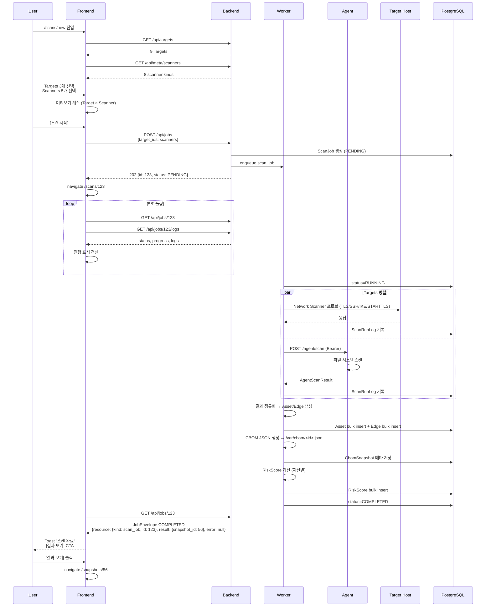

### 10.6.2 핵심 UX

- **미리보기**: 사용자가 선택을 바꿀 때마다 즉시 "최대 N개 작업 실행 예정" 표시
- **실시간 로그**: ScanRunLog가 추가되면 진행 화면에 즉시 추가 (TanStack Query refetchInterval)
- **부분 실패 표시**: 일부 ScanRunLog가 실패해도 Job 자체는 COMPLETED로 끝나며, 실패 항목은 로그에 명시
- **완료 즉시 결과 진입 동선**: Toast의 CTA로 한 번에 이동

### 10.6.3 취소 흐름

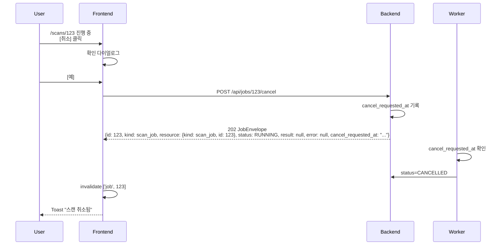

`scan_job`과 `discovery`는 `PENDING`/`RUNNING` 취소 가능하다. `recompute`는 `PENDING`만 취소 가능하며 `RUNNING` 이후에는 `409 job_not_cancellable`을 반환한다. 취소된 scan은 Snapshot을 만들지 않는다. 취소된 discovery는 이미 저장된 endpoint를 partial 결과로 보존한다.

## 10.7 F5: Asset 탐색 및 상세 조회

### 10.7.1 진입 경로

- Dashboard에서 KPI 카드/차트 클릭
- Snapshots 목록에서 스냅샷 열기
- 사이드바 → Snapshots → 최신 → 자동 진입
- Risk Assessment의 자산 행 클릭

### 10.7.2 시퀀스

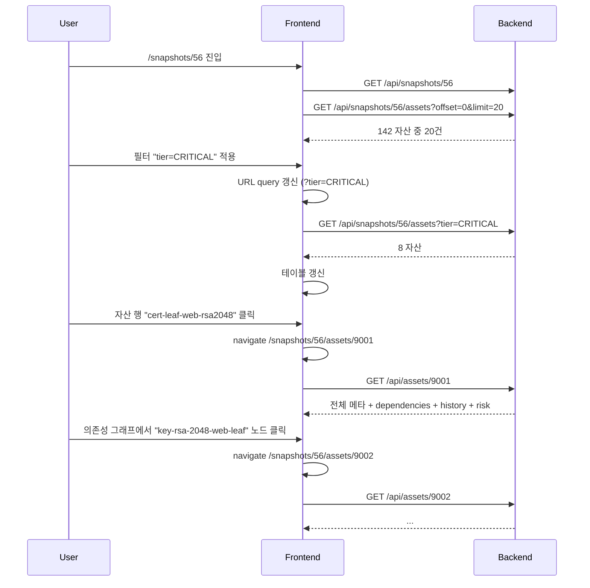

### 10.7.3 핵심 UX

- **URL ↔ 필터 동기화**: 사용자가 필터를 적용하면 URL에 반영 → 공유/새로고침 가능
- **그래프 노드 클릭 네비게이션**: 의존성 그래프 내에서 자산 간 자유 이동
- **Trend 차트로 히스토리 자연스럽게 노출**: 같은 자연 키 자산의 과거 점수 변화

## 10.8 F6: Risk Assessment + 가중치 조정

### 10.8.1 시퀀스

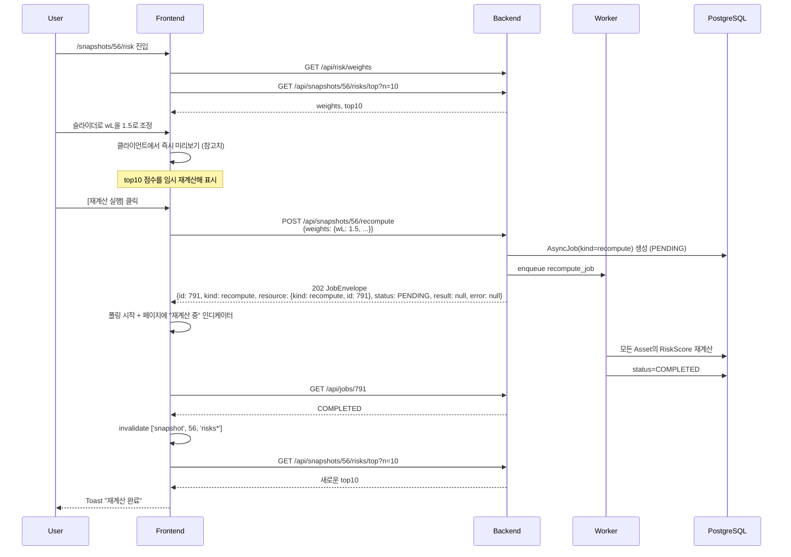

### 10.8.2 핵심 UX

- **즉시 미리보기**: 슬라이더 조정 시 클라이언트에서 단순 곱셈으로 점수 임시 표시 (서버 호출 없이)
- **명시적 재계산**: 사용자가 [재계산 실행]을 눌러야 서버에 반영
- **default 저장 옵션**: "이 가중치를 default로 저장" 체크박스 → `persist_weights_as_default`

## 10.9 F7: Migration Plan 검토 + 보고서 생성

### 10.9.1 시퀀스

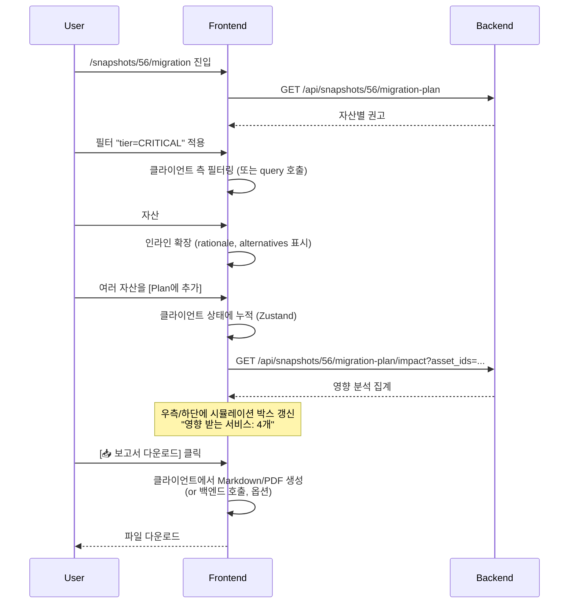

### 10.9.2 보고서 형식

본 캡스톤에서는 **Markdown 다운로드**를 기본으로 한다. PDF는 v2.

보고서 구조:
- Snapshot 메타 정보
- 선택된 자산 일람 (위험도 순)
- 자산별 권고: 현재 알고리즘, 권장 알고리즘, 전략, 사유
- 영향 분석 (서비스 단위, 호스트 단위 집계)
- Appendix: 위험도 인자 표

상세는 `11-migration-plan.md` 참고.

## 10.10 F8: CBOM Snapshot Diff 비교

### 10.10.1 시퀀스

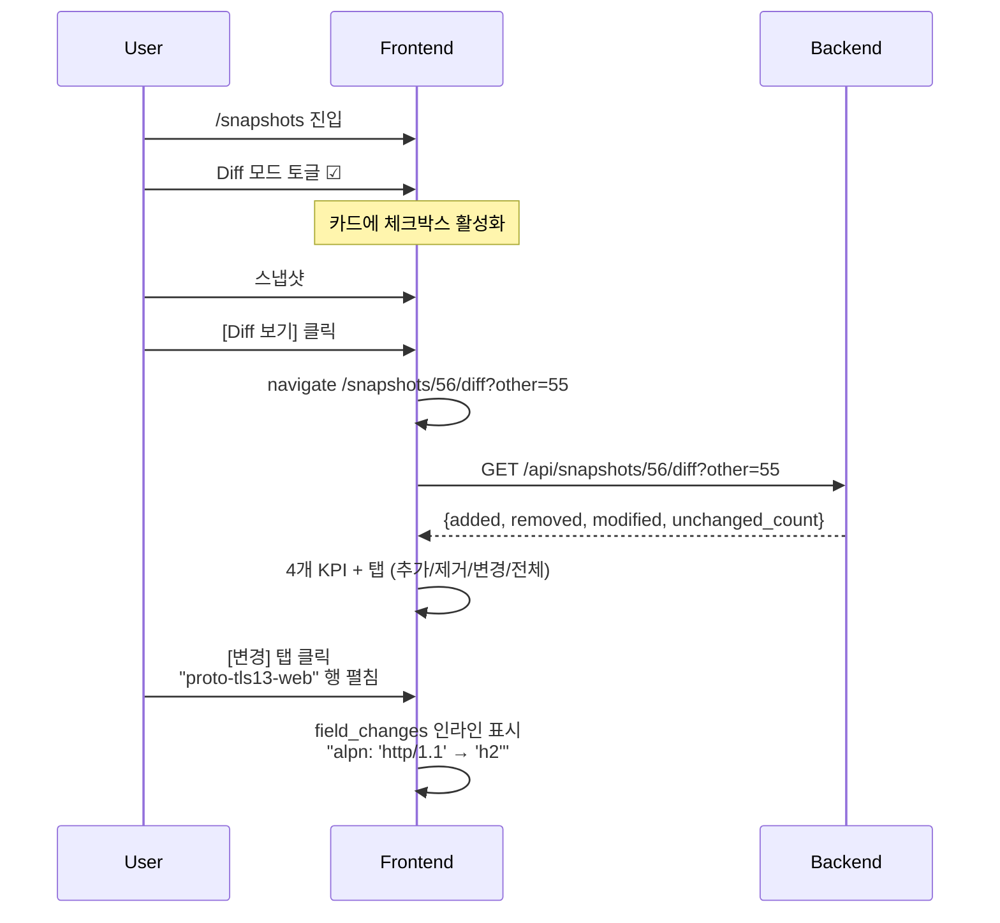

### 10.10.2 핵심 UX

- **자연 키 매칭 결과를 사용자에게 노출하지 않음**: 사용자는 "추가/제거/변경"만 봄. 매칭 알고리즘은 5.9.2에 따라 백엔드가 처리
- **변경 항목의 시각적 강조**: before/after를 inline diff로 표시 (단일 라인은 `[old] → [new]`, 객체는 JSON diff)

## 10.11 F9: Asset 컨텍스트 Override + 재계산

### 10.11.1 시퀀스

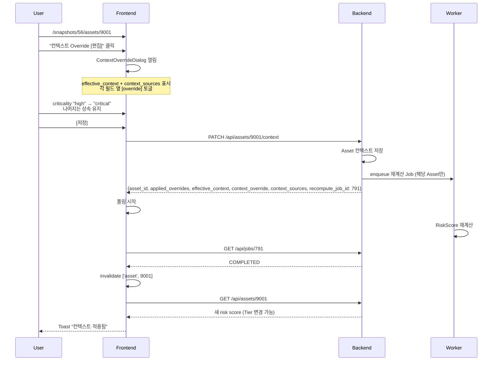

### 10.11.2 Override UI

```
┌──────────────────────────────────────────────────────┐
│ 컨텍스트 Override                            [×]      │
├──────────────────────────────────────────────────────┤
│ 다음 값들은 Target에서 상속됩니다.                    │
│ Override가 필요한 필드만 토글하세요.                   │
│                                                      │
│  ☐ Sensitivity:    high     (Target 상속)            │
│  ☐ Lifespan:       10 years (Target 상속)            │
│  ☑ Criticality:    [critical ▼]  ← override          │
│  ☐ Exposure:       internal (Target 상속)            │
│  ☐ Service Role:   web-fe   (Target 상속)            │
│                                                      │
│                                [취소]  [저장]         │
└──────────────────────────────────────────────────────┘
```

토글 OFF면 상속, ON이면 직접 입력 필드 활성화. 저장 시 ON된 값만 PATCH.

## 10.12 F10: Agent 등록 흐름 (사용자 비개입)

### 10.12.1 시퀀스

사용자는 직접 개입하지 않으며, 테스트베드 docker-compose가 기동될 때 자동으로 발생한다.

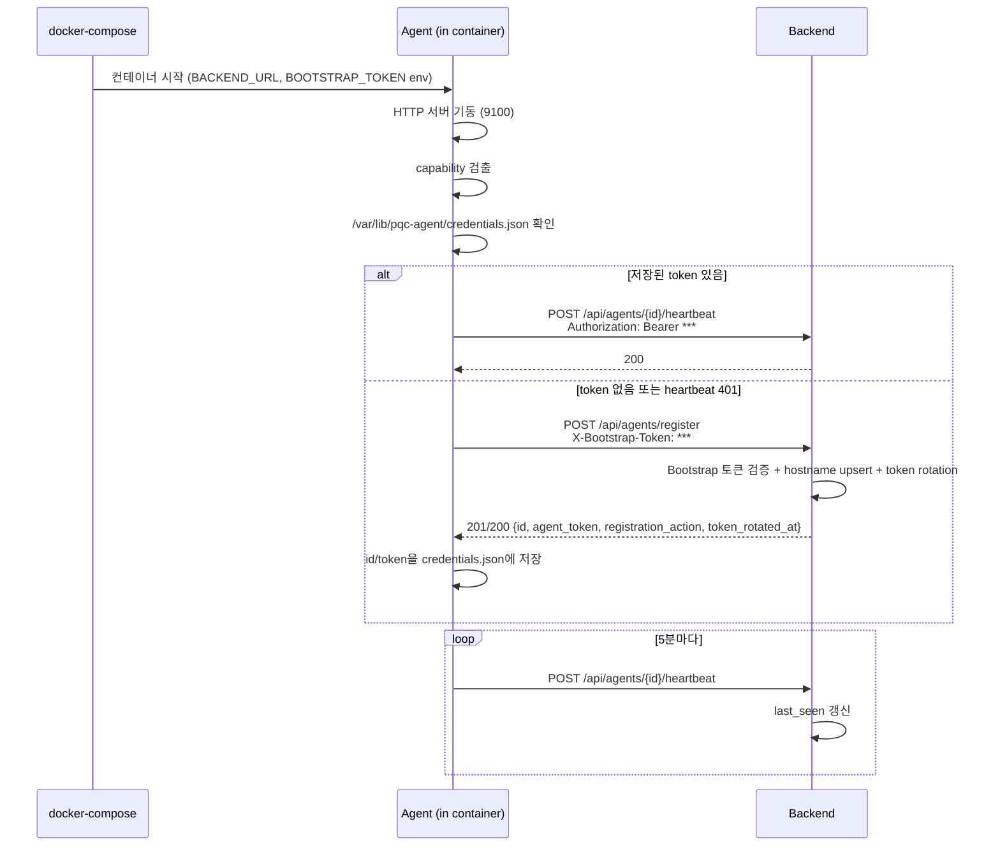

### 10.12.2 사용자 가시성

- Agents 페이지(`/agents`)에 자동 등록된 Agent들이 나타난다.
- "Active" 상태 배지로 헬스 표시 (`last_seen < 5min`).
- 사용자가 비활성화하고 싶으면 `[비활성화]` 버튼 (DELETE).

## 10.13 글로벌 UX 원칙

### 10.13.1 폴링 vs 사용자 대기

- 비동기 작업(스캔/디스커버리/재계산)은 백엔드 처리. 클라이언트는 폴링하며 진행 표시
- 5초 폴링 간격은 서버 부하와 사용자 인지 사이의 균형
- 동기 응답이 빠른 작업(Target CRUD, Asset 조회 등)은 폴링 없음, 즉시 응답

### 10.13.2 빈 상태 (Empty State)

- 모든 목록 페이지에 명시적 Empty State 컴포넌트
- 항상 다음 액션 CTA 포함 ("아직 X가 없습니다. [Y 시작하기]")

### 10.13.3 에러 회복

- 5xx 에러는 자동 1회 재시도 (TanStack Query default)
- 사용자 액션 실패 시 명확한 에러 메시지 + 재시도 버튼
- 폼 검증은 클라이언트에서 1차, 서버에서 2차

### 10.13.4 작업 진행 가시성

- 모든 비동기 작업은 헤더의 "활성 Job 카운터"에 반영
- 클릭 한 번으로 진행 중 Job 목록으로 이동 가능

### 10.13.5 데이터 영속성 안심

- "Snapshot은 영구 보관됩니다"를 Settings/Snapshot 페이지에 명시
- 삭제 작업은 항상 확인 다이얼로그
- 현재 활성 Job이 참조 중인 Target/Snapshot은 삭제 차단 (백엔드 PROTECT)

## 10.14 키보드 단축키 (옵션, v2)

본 캡스톤 v1에서는 단축키 미정의. v2에서 다음 후보:

| 단축키 | 동작 |
|---|---|
| `g d` | Dashboard |
| `g t` | Targets |
| `g s` | Snapshots |
| `n s` | New Scan |
| `?` | 단축키 도움말 |
| `Esc` | 다이얼로그/모달 닫기 |
